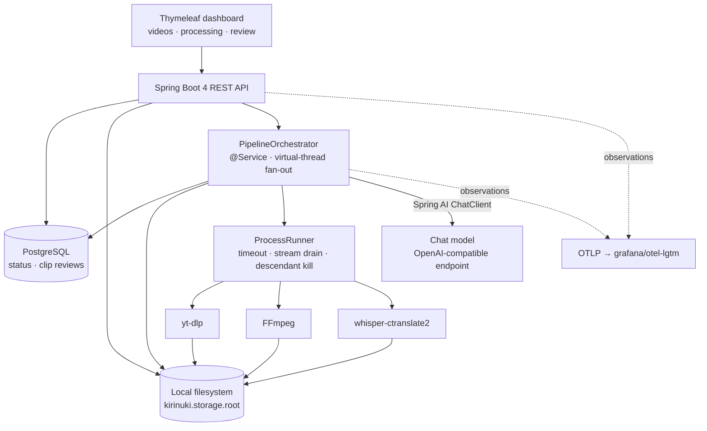
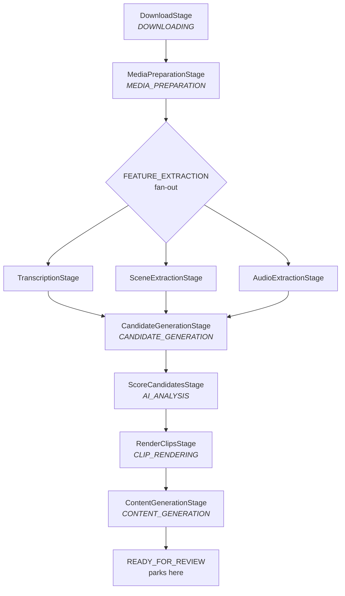
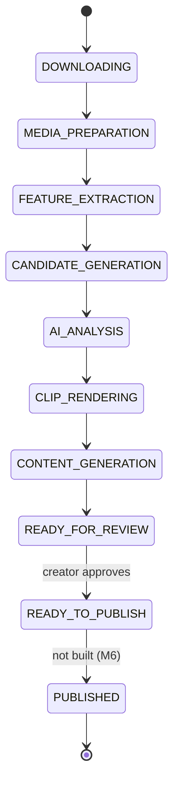

# Kirinuki — Architecture

> Long-form → short-form clip pipeline. Submit a YouTube URL; get back vertical clips of the strongest
> moments, each with per-platform copy, parked for human review. **Publishing is optional** — the core
> value is clip discovery and quality.

**Status: as-built.** M1, M2 and M4 ship; M3 is partial (scene + audio extraction exist,
OCR and visual analysis do not); M5 (auth) and M6 (publishing) are not started. Anything below marked
*(not built)* is design intent, not code.

Four decisions define the shape:

1. **Source: YouTube** — the creator submits a video URL; **yt-dlp** pulls it (ADR-0003).
2. **Orchestration: Spring-native** — a `PipelineOrchestrator` `@Service` drives the pipeline; no
   external workflow engine.
3. **Storage: local filesystem** — a directory per video is the blackboard and the source of truth.
4. **Inference: local** — nothing leaves the box (amended: the LLM
   is reached over an OpenAI-compatible endpoint, which Ollama serves at `:11434/v1`).

---

## Design principles

1. **Each ingested video is a long-running workflow.** It pauses indefinitely at human review.
2. **The filesystem is the source of truth; Postgres holds status and pointers.** If an artifact exists
   on disk, that stage is done — the database is a projection, not the authority on work completed.
3. **Every stage is idempotent, keyed by its artifact.** Skip-if-artifact-exists *is* the resume
   mechanism. There is no separate checkpoint table.
4. **AI is one service among many.** Deterministic media work does most of the job; the model is
   invoked only where judgement is required, and it never drives control flow.

---

## System shape

Strip the vocabulary and this is **a Spring-native orchestrator coordinating deterministic media
processing and local inference**. One `@Service` manages the long-running workflow, its retries, its
parallelism and its human pause. FFmpeg and Whisper transform media. The filesystem is the shared
blackboard every stage reads from and writes to. The model is consulted twice — once for judgement
(which moments), once for copy (what to say about them) — and never for control flow.

The consequence worth naming: adding a platform, a model, or an analysis stage is *adding one stage to
the orchestrator*, not redesigning the system.



### Component inventory

| Component | Role | Built? |
|---|---|---|
| **Thymeleaf dashboard** | Submit a URL, watch progress, review/edit/approve/download clips | ✅ |
| **Spring Boot 4 REST API** (Framework 7) | REST surface, business logic, hosts the orchestrator | ✅ |
| **`PipelineOrchestrator`** | The state machine: Postgres-authoritative status, virtual-thread fan-out, artifact-keyed resume, startup recovery | ✅ |
| **Spring AI** (`ChatClient`, structured output) | Scoring and content generation over an OpenAI-compatible endpoint | ✅ |
| **PostgreSQL** + Flyway | `video` (metadata, status, `last_error`), `clip_review` (edits, decisions, `@Version`) | ✅ |
| **Local filesystem** | The blackboard: source, audio, transcript, features, candidates, scores, clips | ✅ |
| **`ProcessRunner`** | Every external binary: virtual-thread stream drains, per-tool timeout, descendant kill | ✅ |
| **yt-dlp** · **FFmpeg** · **whisper-ctranslate2** | Acquisition, media transforms, ASR — external pinned binaries | ✅ |
| **OpenTelemetry** (Micrometer → OTLP) | One trace per video; timer metrics per stage and tool | ✅ |
| **Docker Compose** | Postgres + `grafana/otel-lgtm` for local infra | ✅ |
| **GitHub Actions** | CI: test → build | ✅ |
| **OCR service** | Text from slides / code on screen | ☐ M3 |
| **Visual analysis service** | Faces, gestures, screen-share regions, transitions | ☐ M3 |
| **Spring Security** | Authentication, multi-user | ☐ M5 |
| **YouTube Data API** | Detect new uploads on a connected channel — *detection only*, yt-dlp still downloads (ADR-0004) | ☐ M5 |
| **Publishing integrations** | YouTube · LinkedIn · TikTok · X · Instagram — OAuth, upload, metadata | ☐ M6 |

**Deliberately absent:** a message broker (artifact-keyed stages already give resume and independent
retry) and a vector store / RAG layer (there is no retrieval requirement). Either can be added later
against a concrete need.

### Designed now, built later

- **Series packaging** (M7) — group clips into an ordered, themed release ("Part 1/2/3"): deterministic
  clustering plus the model for naming and ordering.
- **Analytics learning loop** (M8) — pull per-post performance, recommend what to make next, and feed
  priors back into scoring. This is what turns the one-way pipeline into a closed loop.

---

## The orchestrator in one page

`PipelineOrchestrator` holds `List<PipelineStage>` grouped by status, and nothing else. Every stage
implements three methods:

```java
public interface PipelineStage {
    PipelineStatus status();   // the status this stage runs at
    String artifact();         // the file that proves it finished
    void run(Video video);     // do the work, writing to the .part path
}
```

`advance(videoId)` loops: look up the stages for the video's current status, run them, move the status
to `next()`, repeat until a status has no stages. Then it stops and logs where it parked.

**Three mechanisms carry all the durability:**

**Artifact commit.** A stage writes to `{artifact}.part` — the marker goes *before* the extension
(`audio.part.wav`) because ffmpeg and yt-dlp both infer the container from the suffix. The orchestrator
atomically renames it on success and deletes it on failure. A killed subprocess therefore never leaves
a truncated file that `exists()` would trust.

**Fan-out.** Stages sharing a status run on virtual threads. If several fail, the first is thrown and
the rest attached with `addSuppressed`, so a log line shows every failure rather than whichever
finished last.

**Recovery.** On `ApplicationReadyEvent`, `PipelineRecovery` re-drives every video whose status is
`resumable`. It does not consult artifacts — idempotency lives in the orchestrator's skip check, so
re-driving a nearly-finished video costs one `exists()` call per completed stage.

`startAsync` guards with an in-memory `Set<UUID>`, so a double-submit is a no-op **within one JVM**.
That guard does not survive a restart and does not span instances.

---

## Pipeline stages — what each one does and what it emits

Nine stages. Three share `FEATURE_EXTRACTION` and fan out.



### 1. DownloadStage — `DOWNLOADING` → `source.mp4`

Runs yt-dlp twice: `--dump-json --no-playlist` first to read metadata (title, duration, uploader,
YouTube id) into the `video` row, then the download itself with
`-f bestvideo[ext=mp4]+bestaudio[ext=m4a]/best[ext=mp4]/best --merge-output-format mp4`. YouTube stores
video and audio as separate adaptive streams, so the format string picks the best of each and merges.

**Output:** `source.mp4` — the muxed source at its native resolution.

> No `@ConcurrencyLimit`, unlike every other stage. N concurrent submissions start N downloads.

### 2. MediaPreparationStage — `MEDIA_PREPARATION` → `audio.wav`

One ffmpeg pass: `-vn -ac 1 -ar 16000 -c:a pcm_s16le`. Mono 16 kHz PCM, because that is exactly what
Whisper wants — handing it anything else just makes it resample internally.

**Output:** `audio.wav` — mono, 16 kHz, signed 16-bit PCM.

### 3a. TranscriptionStage — `FEATURE_EXTRACTION` → `transcript.json`

`whisper-ctranslate2 --word_timestamps True --output_format json`. Word-level timestamps are not a
nicety: every later boundary decision (candidate windows, snap-to-silence, caption timing) is expressed
in word indices, so a segment-level transcript would collapse the whole downstream design.

**Output:** `transcript.json` → `List<Word>` of `{text, start, end}`, seconds as doubles.

### 3b. SceneExtractionStage — `FEATURE_EXTRACTION` → `scenes.json`

`-vf select='gt(scene,0.4)',metadata=print:file=-` and parse the printed timestamps. ffmpeg's own scene
score, no library.

**Output:** `scenes.json` → `List<Double>`, the timestamp of each detected cut.

### 3c. AudioExtractionStage — `FEATURE_EXTRACTION` → `audio-features.json`

`-af silencedetect=noise=-30dB:d=0.5` over `audio.wav`.

**Output:** `audio-features.json` → `{silences: [{start, end}]}`.

> **Only two of four extractors exist.** OCR and visual analysis are M3 and unbuilt. They are also what
> content-aware reframing (FR-RENDER-6) needs — see *Known limitations*.

### 4. CandidateGenerationStage — `CANDIDATE_GENERATION` → `candidates.json`

Deterministic, no model. Reads all three feature artifacts, splits the word stream into segments at
silence midpoints and scene cuts, then grows windows from consecutive segments — bounded by
`candidates.min-duration` (20s) and `max-duration` (60s), capped at `max-candidates` (40). The cap exists because scoring cost is linear in candidates and unbounded input
means hours of inference.

**Output:** `candidates.json` → `List<Candidate>` of
`{id, start, end, firstWordIndex, lastWordIndex, text}`.

### 5. ScoreCandidatesStage — `AI_ANALYSIS` → `scored.json`

**One LLM call per candidate** via `ChatClient.entity(CandidateScore.class)`, at
`scoring.temperature: 0.0` so runs are comparable. The system prompt carries a 1–10 calibration scale
and three few-shot examples (weak / solid / strong) — without them a small model rates everything 5.

The model returns **sub-scores only**; it never returns an overall score. `CandidateScorer` clamps each
to 0–10, then computes:

```
weighted     = 3·hook + 2·educationalValue + 1·emotion + 3·virality      (max 10 · 9 = 90)
overallScore = round(100 · weighted / (10 · total))                      → 0 … 100
```

Ranking therefore stays explainable and retunable in config without re-prompting. Candidates below
`min-score` are dropped, then overlapping windows sharing more than 50% of the shorter one are deduped,
then the top `top-clips` (8) survive. A failed call skips that one candidate; every candidate failing
throws.

**Output:** `scored.json` → `List<ScoredCandidate>` of `{candidate, score, overallScore}`, ranked.

### 6. RenderClipsStage — `CLIP_RENDERING` → `clips.json` + `clips/`

Three deterministic steps per clip.

**Boundary refinement** (`BoundaryRefiner`) snaps each start/end to a nearby silence or scene cut within
`snap-tolerance` (1200ms), then applies `lead-in` (400ms) and `tail` (600ms) so a clip does not open
mid-syllable.

**Subtitle generation** (`SubtitleWriter`) emits ASS, grouping words `words-per-caption` (3) at a time,
rebasing timestamps onto the clip start.

**The ffmpeg filtergraph** produces 1080×1920 from a source that is usually a 16:9 screen-share:

```
[bg] scale→crop→boxblur=8:2 → the blurred backdrop filling the frame
[fg] scale to width·zoom, centre-crop → the real video, overlaid
     subtitles=clip-N.ass                → captions burned in
```

Centre-cropping alone was tried and rejected: on a screen-share it slices code in half. `render.zoom`
trades dead space against cropped edges.

**Output:** `clips/clip-{n}.mp4` and `clips/clip-{n}.ass`, plus `clips.json` →
`List<Clip>` of `{index, start, end, overallScore, reason, video}`.

> Clip mp4s are written directly, not through the `.part` commit scheme — a killed render can leave a
> truncated mp4 that the skip check trusts.

### 7. ContentGenerationStage — `CONTENT_GENERATION` → `content.json`

One LLM call per clip at `content.temperature: 0.7` (higher than scoring — copy wants variety, ranking
wants determinism), asking for a summary, keywords, tags, and a variant per suggested platform.

A failed call writes a **blank entry carrying the clip's platform list**, never nothing. `ReviewService`
seeds review rows from this file, so a missing entry would make a rendered clip permanently invisible in
the dashboard. Every clip failing throws.

**Output:** `content.json` → `List<ClipContent>` of
`{clipIndex, summary, keywords, tags, platforms:[{platform, title, caption, hashtags, callToAction}]}`.

### 8. Review — `READY_FOR_REVIEW`, and the pipeline stops

`READY_FOR_REVIEW` is **not** resumable, so recovery leaves it alone and it parks indefinitely. On first
read, `ReviewService` seeds one `clip_review` row per clip from `content.json`; from then on that table
is the source of truth for edits and decisions, and `content.json` is only the seed. Seeding tolerates
losing a race — two first loads both insert, and the loser falls through to reading what the winner
wrote rather than dying on the unique `(video_id, clip_index)` index.

Edits are guarded by `@Version`. The version travels out on the response and back on the edit request,
so the service edits against the version the client was *holding*, not against a fresh read — otherwise
a form left open for minutes would still overwrite whatever landed in between. A mismatch is a `409`,
not a `500`. `regenerate` deliberately runs outside a transaction: it makes N model calls between the
read and the write, and `merge()` checks the version without pinning a connection for minutes.

Approving the video moves it to `READY_TO_PUBLISH`, which **is** marked resumable although no stage
declares it — deliberately, so the approved backlog drains automatically once a publish stage exists
(M6). Until then each approved video costs one no-op write and one log line per restart.

---

## Status model

`video.status` is a `PipelineStatus` enum; `next()` is ordinal arithmetic, so **enum order is the
pipeline order** and inserting a constant mid-list changes the flow.



`resumable` decides what recovery re-drives: every status above is resumable **except**
`READY_FOR_REVIEW` and `PUBLISHED`, the two that wait on a human or are terminal.

`last_error` holds the failure message, truncated to 1024 chars. It is cleared whenever a video is
re-driven, and persisted immediately even when no stage runs.

---

## Storage layout

Rooted at `kirinuki.storage.root`, one directory per video. Artifact names are the constants in
`pipeline/Artifacts.java` — the filename *is* the completion marker, so these are API, not convention.

```
{kirinuki.storage.root}/{videoId}/
├── source.mp4              # DownloadStage
├── audio.wav               # MediaPreparationStage — mono 16kHz PCM
├── transcript.json         # TranscriptionStage    — List<Word>, word-level
├── scenes.json             # SceneExtractionStage  — List<Double>, cut timestamps
├── audio-features.json     # AudioExtractionStage  — {silences:[{start,end}]}
├── candidates.json         # CandidateGenerationStage — List<Candidate>
├── scored.json             # ScoreCandidatesStage  — List<ScoredCandidate>, ranked
├── clips.json              # RenderClipsStage      — List<Clip>
├── content.json            # ContentGenerationStage — List<ClipContent>
└── clips/
    ├── clip-1.mp4
    ├── clip-1.ass
    └── ...
```

**Nothing ever deletes a video directory.** `StorageService` only removes `.part` files. A retention
policy is the largest unbuilt operational gap — when the disk fills, the symptom is an opaque ffmpeg
exit code, not "out of space".

---

## Interfaces

**REST** — `POST /videos` returns `202` at `DOWNLOADING`; the download is a stage, not a blocking call.
`GET /videos/{id}` carries `lastError`. `POST /videos/{id}/advance` re-drives (409 if not resumable).
`GET /videos/{id}/{transcript,candidates,scored,clips,content}` serve artifacts; `/clips/{index}` serves
the mp4. Review lives under `/videos/{id}/review`.

**Dashboard** — server-rendered **Thymeleaf**, not a SPA: `videos.html`, `processing.html` (live stage
progress plus a retry button when `lastError` is set), `dashboard.html` (per-clip player, transcript,
sub-score bars, edit/approve/reject/regenerate/download).

**Errors** — two advices, deliberately. `GlobalExceptionHandler` is scoped
`@RestControllerAdvice(annotations = RestController.class)` and returns RFC 9457 `ProblemDetail`;
`DashboardExceptionHandler` is scoped to `DashboardController` and renders `dashboard-error.html`. A
browser must never receive a raw ProblemDetail body. Both stay single-handler because `KirinukiException`
carries its own `HttpStatus` and title.

**Observability** — stages and external tools are wrapped in Micrometer `Observation`s, so one video is
one trace: `kirinuki.pipeline` → `kirinuki.stage` → `kirinuki.tool` / `spring_ai chat_client`, exported
over OTLP to `grafana/otel-lgtm`.

---

## External tools

Every binary runs through `common/ProcessRunner`: virtual-thread stream drains (a full pipe buffer
deadlocks the child otherwise), a per-tool timeout, and descendant-kill on timeout. A missing binary
raises `ToolNotAvailableException`, which is deliberately **never retried** — retrying a binary that is
not installed just delays the same failure.

| Tool | Used by | Timeout |
|---|---|---|
| `yt-dlp` | DownloadStage | 60s metadata / 30m download |
| `ffmpeg` | audio extract, scene detect, silence detect, render | 30m |
| `whisper-ctranslate2` | TranscriptionStage | 2h |

---

## Known limitations

**Source resolution.** A 720p screen-share cropped to 9:16 yields 405×720 upscaled to 1080×1920. The
blurred-fill layout is the deterministic fallback; content-aware ROI cropping needs the M3 OCR/visual
extractors.

**No authentication anywhere** (M5). Every endpoint and the whole dashboard are open.

**Unbounded downloads.** `DownloadStage` carries neither `@ConcurrencyLimit` nor `@Retryable`.

**`@ConcurrencyLimit(1)` is per bean-method**, so the three `FEATURE_EXTRACTION` stages still run
whisper and two ffmpeg passes simultaneously. It serialises across videos, not within one.

---

## Open decisions

- **Per-role models** — which local LLM and ASR model; driven by the quality gate and VRAM budget.
- **OCR and visual libraries** — unbuilt, M3.
- **Retention policy** — what "done" means for a processed video: keep clips and drop the source? TTL?
- **Publishing scope** — which platforms first (M6).
- **Message broker / vector store** — deliberately absent. The artifact-keyed stages already provide
  resume and independent retry, and there is no retrieval requirement. Add only on a concrete need.
