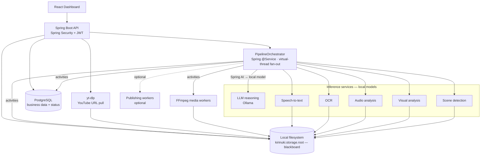
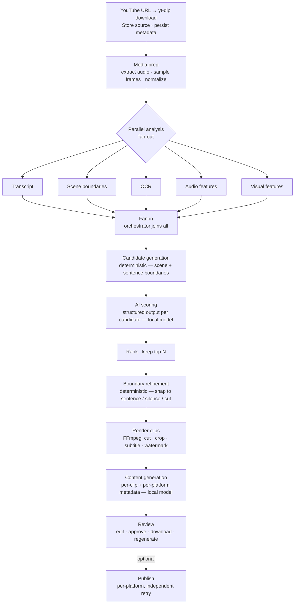
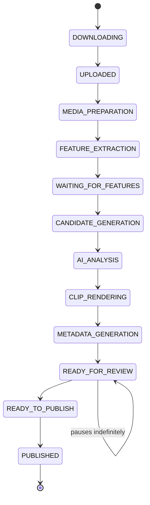

# Kirinuki — Architecture

> Long-form → short-form clip pipeline. Ingests a long YouTube video (submit a URL), discovers the
> best moments, and produces polished, ready-to-publish short clips with per-platform metadata.
> **Publishing is optional** — the core value is clip discovery + quality.

**Status:** design only. The system is **fully local**: local video source ingest, local filesystem
storage, local Postgres, and **local inference models**. Four decisions define the shape:

1. **Source: YouTube** — the creator submits a video URL; the API pulls it with **yt-dlp**.
2. **Orchestration: Spring-native** — a `PipelineOrchestrator` `@Service` drives the pipeline; there is
   no separate workflow engine (see [ADR-0002](DECISIONS.md)).
3. **Storage: local filesystem** — a local directory is the blackboard / source of truth.
4. **Inference: local models** — every inference role runs self-hosted; nothing leaves the box
   (see [ADR-0001](DECISIONS.md)). Exact per-role model is tuned later; the hosting axis is decided.

---

## Design principles

1. **Each ingested video is a long-running workflow.** It can pause for hours/days at human review.
2. **Local storage is the source of truth.** The database holds only metadata and pointers.
3. **Every expensive stage is idempotent and independently retryable**, keyed by `(videoId, stage)` —
   this doubles as the resume mechanism (skip a stage whose artifact already exists).
4. **AI is one service among many** — deterministic media/compute stages do most of the work; the
   model is only invoked where genuine reasoning is required, and it never drives the control flow.

---

## Component inventory (everything the system uses)

Grouped by role. Inference hosting is **local**; exact per-role models are tuned at the M1 quality gate.

### Application & orchestration
| Component | Role |
|---|---|
| **React dashboard** | Submit URL, review, edit, approve, download, trigger publish |
| **Spring Boot 4 API** (Spring Framework 7) | REST API, business logic, hosts the pipeline orchestrator |
| **Spring Security + JWT** | Authentication / authorization |
| **`PipelineOrchestrator`** (Spring `@Service`) | Drives the pipeline state machine — Postgres-authoritative status, Spring Retry (`@Retryable`) for transient failures, **virtual-thread** fan-out/fan-in, startup recovery scan. No external workflow engine. |
| **Spring AI** (`ChatClient`, structured output) | In-app orchestration of the LLM reasoning stages, **over a local model** |

### Data & storage
| Component | Role |
|---|---|
| **PostgreSQL** (+ Flyway migrations) | Business data: video metadata, clips, generated content, user prefs, platform connections, projected pipeline status |
| **Local filesystem** (`kirinuki.storage.root`) | The blackboard: raw video, audio, frames, transcript, OCR, features, candidates, rendered clips |

### Inference services — local models (exact model per role TBD)
| Service | Produces | Local tooling (proposed) |
|---|---|---|
| **LLM reasoning service** | Candidate scoring + per-clip content generation | Local model via **Ollama** behind Spring AI |
| **Speech-to-text (ASR) service** | Transcript with word-level timestamps | Local **Whisper** (`faster-whisper` / `whisper.cpp`) |
| **OCR service** | Text from slides / code / on-screen text | Local (Tesseract or a local vision-language model) |
| **Audio analysis service** | Silence, laughter, applause, excitement markers | Local library/model |
| **Visual analysis service** | Faces, gestures, screen-share, transitions | Local library/model |
| **Scene detection** | Scene / shot boundaries | Local library |

### Media & platform
| Component | Role |
|---|---|
| **yt-dlp** | Acquire the source video from a YouTube URL + read its metadata. External, pinned binary (like FFmpeg). |
| **YouTube Data API** (optional, later) | Detect new uploads on a connected channel (uploads playlist) for scheduled auto-ingest — **detection only**; yt-dlp still does the download. |
| **FFmpeg** | Deterministic media transforms: extract audio/frames, normalize, cut, crop, resize, subtitle, watermark, thumbnail |
| **Publishing integrations** (optional, later) | YouTube · LinkedIn · TikTok · X · Instagram — OAuth + upload + metadata |

### Cross-cutting
| Component | Role |
|---|---|
| **OpenTelemetry** (`spring-boot-starter-opentelemetry` + Micrometer/OTLP) | Traces, metrics, logs |
| **Docker + Docker Compose** | Local + deploy packaging (pinned tags, healthchecks) |
| **GitHub Actions** | CI: test → build → deploy |

### Future layer (designed now, built later)
| Capability | Role |
|---|---|
| **Series packaging** | Group clips into an ordered, themed release series ("Part 1/2/3") — deterministic clustering + Spring AI naming/ordering |
| **Analytics learning loop** | Pull per-post performance stats, learn what the audience loves, recommend what to make/post next, and feed priors back into scoring |

**Deliberately NOT included:** a separate message broker (the orchestrator's idempotent, artifact-keyed
stages provide resume and independent retry) and a vector store / RAG layer (there is no retrieval
need). Both can be added later *if* a concrete requirement appears — flagged in [Open Decisions](#open-decisions).

---

## High-level architecture



---

## Pipeline flow



### Phase notes

- **Acquisition** — pull the source video from the submitted YouTube URL with **yt-dlp**, store it in
  local storage, persist metadata (title, duration, uploader, YouTube id), start the workflow. *(Later:
  a connected channel is polled via the YouTube Data API and new uploads enter this same path
  automatically — see [ADR-0004](DECISIONS.md).)*
- **Media prep** — extract audio, **sample frames sparsely / on demand** (not every frame — thousands
  per hour balloons storage), normalize video.
- **Parallel analysis** — all five feature services run independently and publish results to local
  storage. They never talk to each other.
- **Fan-in** — the orchestrator joins the fan-out (virtual threads) and proceeds only when all feature
  artifacts exist. No polling, no flags.
- **Candidate generation** *(deterministic, no AI)* — build candidate windows from **scene + transcript
  sentence boundaries** so they're semantically meaningful (tens, not hundreds) and don't overwhelm the
  reasoning stage.
- **AI scoring** *(Spring AI → local model)* — score candidates with structured output (hook, education,
  emotion, virality, platforms, reason, overall score). Processed in chunks sized to the local model's
  context. Schema-validated; invalid output fails and retries.
- **Ranking** — sort by score, keep top N (e.g. 8). Pure logic.
- **Boundary refinement** *(deterministic, no AI)* — snap start/end to the nearest sentence end / silence
  gap / scene cut using word-level timestamps. Avoids awkward cuts; avoids the model inventing timestamps.
- **Rendering** *(FFmpeg)* — cut, crop, resize, burn subtitles, watermark, thumbnail.
- **Content generation** *(Spring AI → local model)* — universal (summary/keywords/tags) + per-platform
  variants (TikTok / LinkedIn / X / YouTube …). Nothing is posted yet.
- **Review** — the workflow parks here (status `READY_FOR_REVIEW`) until the user decides.
- **Publishing** *(optional)* — off by default. Each platform is independent; a failure on one doesn't
  affect the others. **Download-only ships first**; live posting has API approval gates and is added later.

---

## Workflow state

**PostgreSQL is the authority for pipeline state** — the `video.status` column holds the current stage,
and the `PipelineOrchestrator` drives transitions. Because every stage is idempotent and keyed by
`(videoId, stage)`, a crash or restart is handled by a startup **recovery scan**: any video in a
non-terminal, non-paused state is re-driven, and each stage skips if its artifact already exists — only
an interrupted stage repeats.



---

## Storage layout (local filesystem blackboard)

Rooted at `kirinuki.storage.root`, keyed `{videoId}/{stage}/...`:

```
{kirinuki.storage.root}/{videoId}/
├── source.mp4
├── audio.wav
├── normalized.mp4
├── frames/
├── transcript.json          # word-level timestamps
├── ocr.json
├── audio_features.json
├── visual_features.json
├── scenes.json
├── candidates.json
└── clips/
    ├── clip1.mp4
    └── ...
```

Overwrite-on-retry semantics. Add a retention/cleanup policy — raw + normalized + frames grow fast.

---

## Why this shape

Strip the buzzwords and this is **a Spring-native orchestrator coordinating deterministic media
processing and local inference**. The `PipelineOrchestrator` manages the long-running workflow, retries
(Spring Retry), parallelism (virtual threads), and the human pause (a status row). Spring Boot + Spring
AI provide business logic, prompt orchestration, and APIs. FFmpeg and the feature services transform
media. The local filesystem is the shared blackboard every stage reads from and writes to. Publishing is
an optional capability layered on top.

Adding a new platform, a new model, or a new analysis stage (sentiment, brand safety) becomes *adding
one stage to the orchestrator* — not redesigning the system.

---

## Open Decisions

Deferred until we design the next layer:

- **Exact per-role model** — which local LLM, ASR, OCR, audio, and visual models to run (the *hosting*
  axis is decided: local — see [ADR-0001](DECISIONS.md)); driven by the M1 quality gate and the
  target machine's VRAM/concurrency budget.
- **Feature libraries** — concrete local tools for scene detection, audio analysis, visual analysis.
- **Frame strategy** — sparse sampling vs. on-demand extraction per candidate window.
- **Publishing scope & order** — which platforms first; download-only vs. live posting.
- **Future — series packaging** — grouping/ordering/theming of clips into a release series.
- **Future — analytics learning loop** — performance ingestion + recommendation + priors fed back into
  scoring, turning the one-way pipeline into a closed loop.
- **Vector store / RAG** — only if a retrieval requirement emerges (default: no).
```
